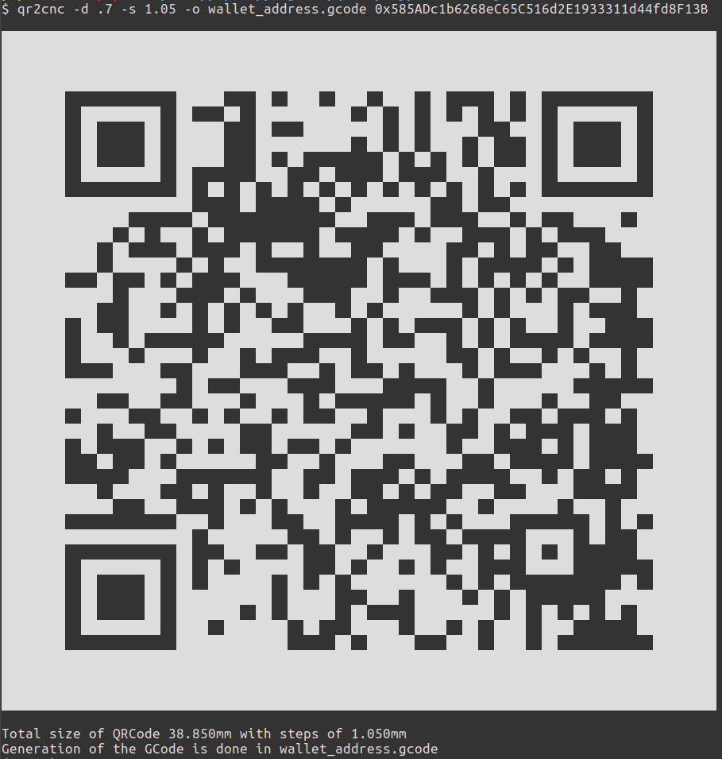
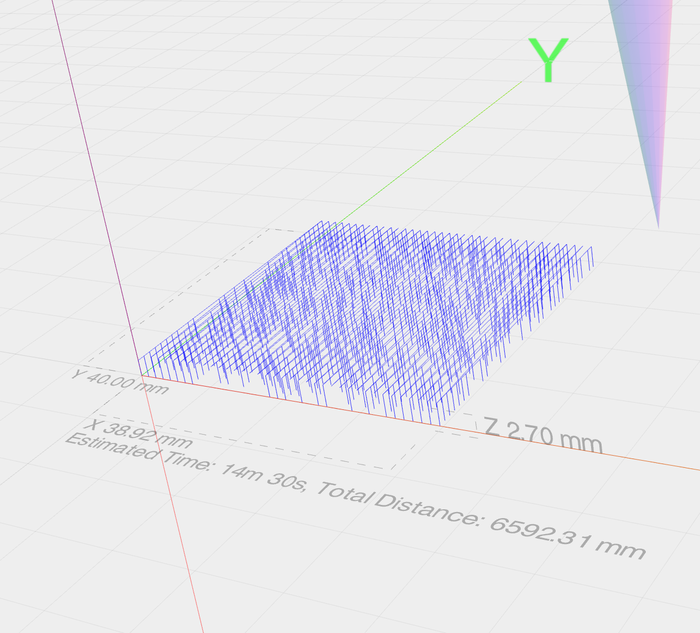
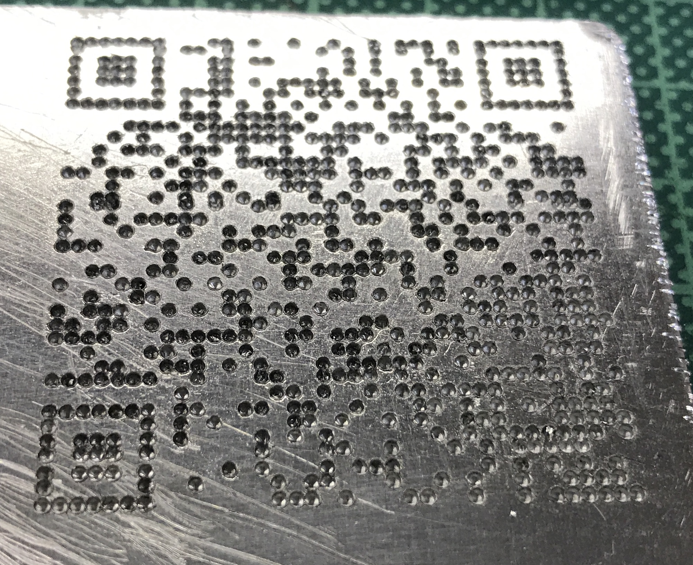
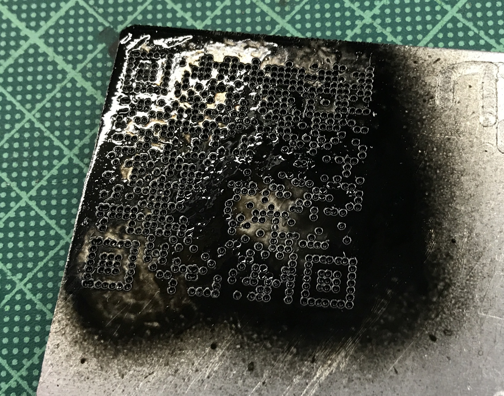
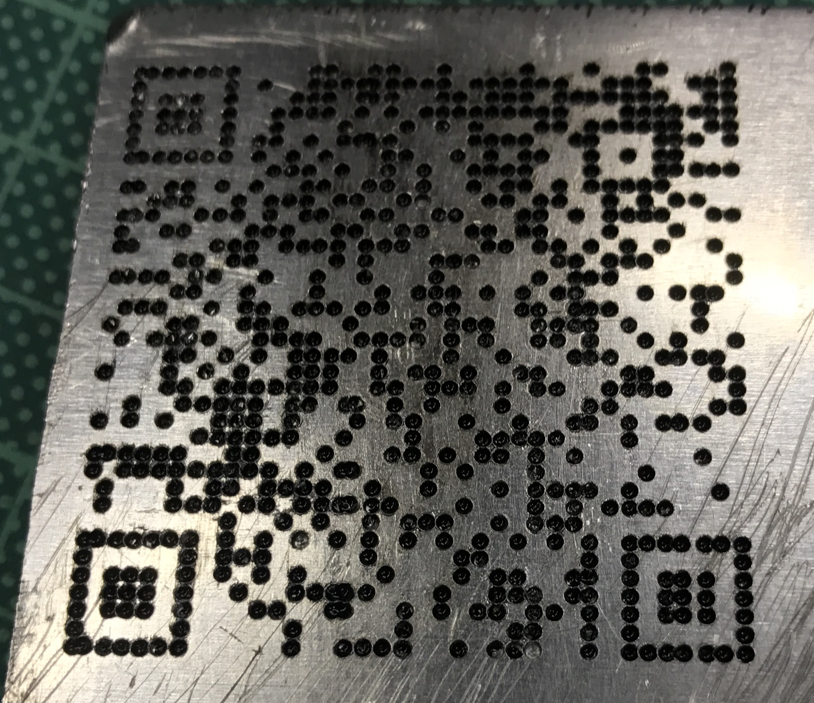

## Crypto currency is precious

As you may know it's really important to move all your crypto currency out from exchanges website, not because they are bad, but because a 100% secure solution don't exist. 

Some examples : 
- 400 000 $ lost from [jaxx](https://www.cryptocoinsnews.com/users-report-losing-400000-due-to-jaxx-wallet-vulnerability/)

## Cold wallet

So the only solution is to use a cold wallet, a wallet offline, and keep it in a safe place, where no one can see it and it can't be damage by anything.

you have few solutions :
- [paper wallet](https://www.bitaddress.org)
- harware wallet like [ledger nano S](https://www.ledgerwallet.com/products/ledger-nano-s)
- usb stick with encrypted data in it, like the [home made tezor](https://steemit.com/trezor/@furion/build-yourself-a-trezor)
- your memory and brain

There is a big down side with this solution, what happend if your house or flat is on fire? Can you be sure that your cold wallet will not melt like snow under sun ? I don't have millions dollars in crypto currency, but I want to keep safe.

## My solution hard wallet DIY

First for the solution I'm going for you need to have some tools, and motivation. I want to print a kind of paper wallet on hard and almost undestructive material.

I looked for a solution I can do alone at home, or safe place with offline tools.

### Principal idea

My future wallet need to be in metal, with public and private key on it, not reconizable as crypto currency wallet by thief.
I didn't want to spend money on it,


### How to make it real ?

I build recently a [CNC machine](https://en.wikipedia.org/wiki/Numerical_control) so it was perfect to use it for this project. Engraving a QRCode on each face of a piece of metal should do the job.

- One QRCode for the wallet address
- One QRCode for the private key

I can control my CNC with [Chilipeppr](http://chilipeppr.com/grbl) witch can be ran offline, but I had no idea how to create my GCode for it using and offline solution. I spend time to look for it, but I found nothing so I decide to make my own software.

I'm a beginer for using CAD tools to create a complex QRCode without error manually. I looked the GCode structure, it's a list of command to move the drill. Generating it using a program is not difficult.

### Python and QRCode

I choose python because it's simple, and work on all platform and there is a tonne of library. I found a lib able to create qrcode from a text, the only thing to do then it's to generate a file for the cnc machine.

No need to do it, I did it and you can use it and modify it as you like.

The path used by Drill is not optimized but work perfectly, just take more time.

### Workflow to create the hard wallet

1. Create a USB Stick with a linux distrib of your choice
2. Boot it on a laptop, connect to internet
3. Open a browser, open tabs 
    1. for generating you bitcoin or ethereum wallet (don't do it)
    2. for Chilipeppr
4. Download my python script, verify everything is working fine, by testing with dummy values
5. Disconnect from internet, go in a bunker without network [I love swiss basement](https://www.swissinfo.ch/eng/prepared-for-anything_bunkers-for-all/995134)
6. Generate your paper wallet
7. Generate both QRCode in GCode using my python script
8. Engrave using Chilipeppr both QRCode, I will do one one each side of the aluminum
    1. I will try to decode the public address QRCode by puting paint to fill all hole and using my smartphone to decode it
9. Power off your computer, remove the battery for at least 15min (should empty residual power for RAM)
10. Destroy the usb stick
11. Store the piece of metal on a safe and hidden place

You can go in a fablab or hacker space to use CNC. but take care of curious eyes.

# Usage of the python app

It's a pure python3.5 project, using only one library pyqrcode
To install it, it's easy using pip

```
$ pip install qr2cnc
```

Then the gcode generator is ready to use, first get some help

```
$ qr2cnc -h
usage: qr2cnc [-h] [-d DEPTH] (-w WIDTH | -s STEP) [-o OUTPUT_FILE] TEXT

Generate CNC QRCode GCode from a string.

positional arguments:
  TEXT                  Text to encode in a QRCode

optional arguments:
  -h, --help            show this help message and exit
  -d DEPTH, --depth DEPTH
                        Depth of each hole of QRCode
  -w WIDTH, --width WIDTH
                        Total size in mm of the final QRCode
  -s STEP, --step STEP  Step per bit in mm of the final QRCode
  -o OUTPUT_FILE, --output OUTPUT_FILE
                        Output GCode file
```

Then the real usage, for an Ethereum wallet
```
$ qr2cnc -d .7 -s 1.05 -o wallet_address.gcode 0x585ADc1b6268eC65C516d2E1933311d44fd8F13B

Total size of QRCode 38.850mm with steps of 1.050mm
Generation of the GCode is done in wallet_address.gcode
```



# Pictures and video







# Feel free to send me a picture of you wallet

No, I'm joking, never show your final product to someone but you can send me some coins for a drink. Or at least a comment to know if somebody use it.
